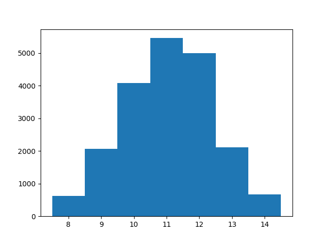
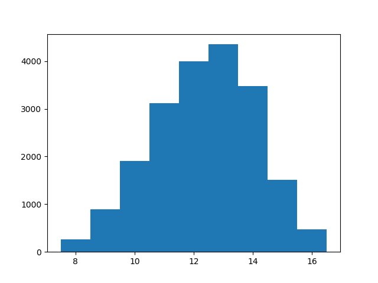
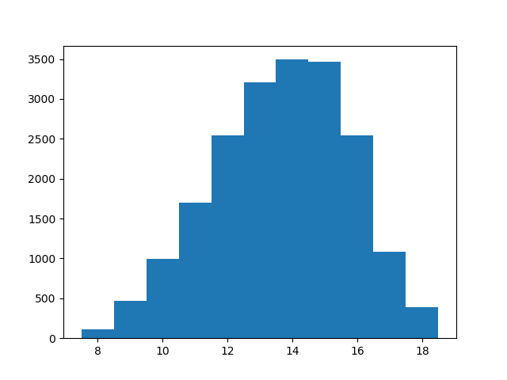
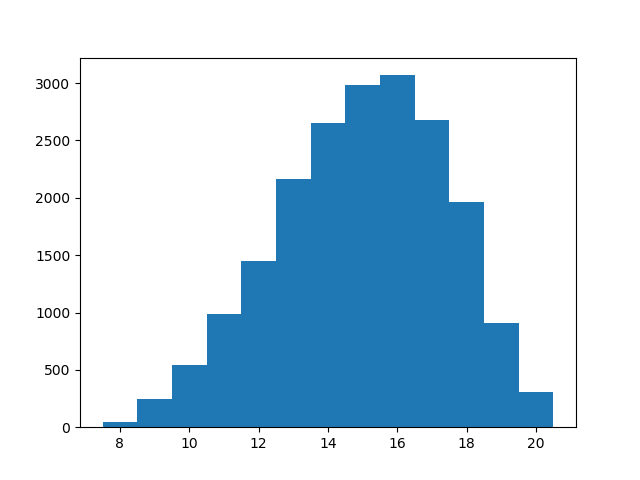

# Quacks
## Introduction
This project tries to find some lower limits for the brew length during the first five rounds of the 
board game the Quacks of Quedlinburg.
As a simplifying assumptionn we assume that the player purchases in every round only two chips
that increase the brew length by 1 each.
A project to find lower limits on the brew length for the game Quacks of Quedlinburg
## Histograms
These histograms are taken over 20000 experiments.

We see that the distribution is markedly non-gaussian and that the tails after the peak of the distribution
very rapidly die off.
In the first round, the peak occurs at 10.
In the second round the peak occurs at 11.
In the third round the peak occurs at 13, although 12 is also pretty big.
In the fourth round the peak occurs at 14/15.
In the fifth round the peak occurs at 16.
