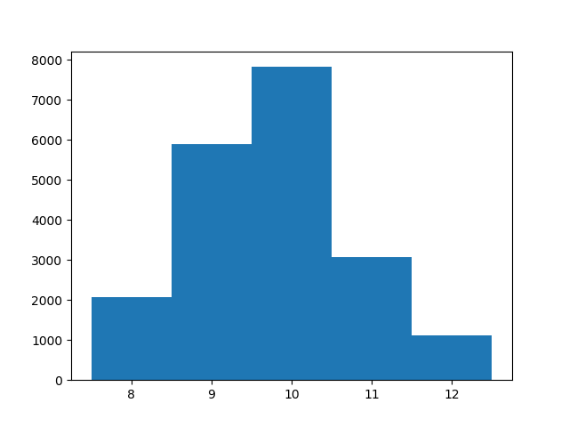

# Quacks
## Introduction
This project tries to find some lower limits for the brew length during the first five rounds of the 
board game the Quacks of Quedlinburg.
As a simplifying assumptionn we assume that the player purchases in every round only two chips
that increase the brew length by 1 each.
A project to find lower limits on the brew length for the game Quacks of Quedlinburg
## Histograms

